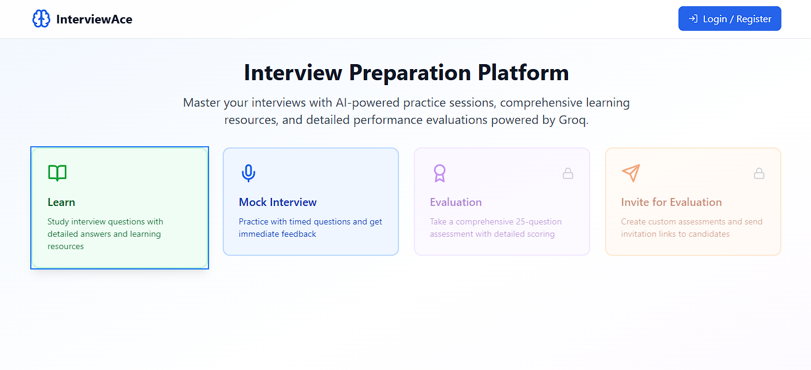
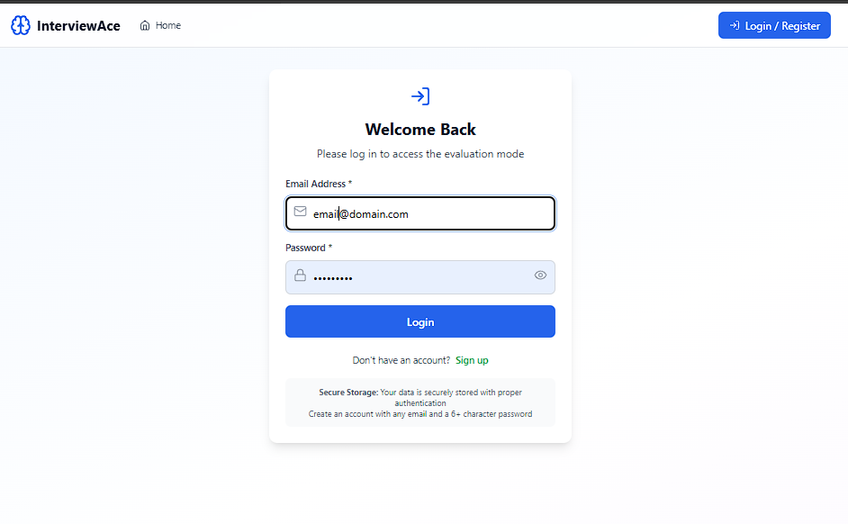
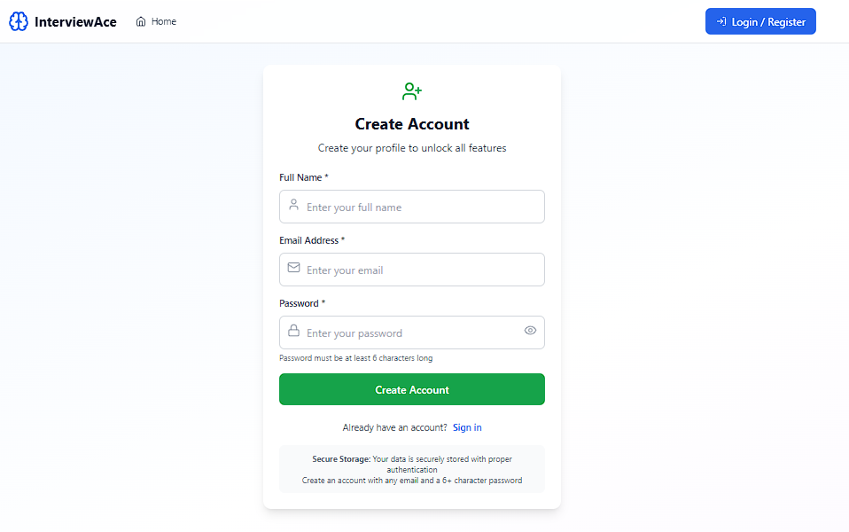

# 🎯 HR Candidate Evaluation System

A comprehensive full-stack web application designed for technical interview preparation and candidate assessment. This system empowers both job seekers and HR professionals with AI-powered interview tools.

## 🌟 Overview

The HR Candidate Evaluation System provides three distinct modes to cater to different needs in the interview process:

- **🎓 Learn Mode**: Interactive practice with immediate feedback
- **⏱️ Mock Mode**: Realistic interview simulation with timed assessments
- **📋 Evaluate Mode**: Professional candidate assessment tools for HR teams

## 🚀 Key Features

### 🤖 AI-Powered Intelligence
- **Smart Question Generation**: Uses Groq's LLaMA model to create diverse, relevant interview questions
- **Intelligent Evaluation**: AI-powered answer assessment with detailed feedback
- **Adaptive Content**: Questions tailored to specific roles and skill levels
- **Fallback Mechanisms**: System continues working even if AI services are unavailable

### 🎯 Multiple Question Types
Support for 8 comprehensive question categories:
- **💻 Coding**: Programming challenges and algorithm problems
- **🧠 Concepts**: Theoretical knowledge and fundamental principles
- **🏗️ System Design**: Architecture and scalability questions
- **👥 Behavioral**: Soft skills and situational scenarios
- **🔧 Technical**: Technology-specific expertise
- **📊 Case Study**: Real-world problem-solving scenarios
- **🏛️ Architecture**: Software design patterns and decisions
- **🐛 Debugging**: Code review and troubleshooting skills

### ⚡ Advanced Capabilities
- **🎤 Voice Input**: Speech-to-text functionality for natural responses
- **⏰ Timed Assessments**: Configurable time limits for questions and overall tests
- **📧 Invitation System**: Secure, unique assessment links for candidates
- **📱 Responsive Design**: Works seamlessly on desktop, tablet, and mobile
- **🔒 Secure Authentication**: JWT-based user management with bcrypt encryption

## 🎮 Application Modes

### 🎓 Learn Mode
**Perfect for interview preparation and skill development**

**Features:**
- Immediate answer visibility after each question
- No time pressure - learn at your own pace
- Detailed explanations and feedback
- Progress tracking across sessions
- Unlimited practice attempts

**Ideal for:**
- Job seekers preparing for interviews
- Students learning new technologies
- Professionals upskilling in their field
- Anyone wanting to practice without pressure

### ⏱️ Mock Mode
**Realistic interview simulation for assessment readiness**

**Features:**
- Timed questions with realistic constraints
- No answer visibility until completion
- Complete assessment simulation
- Performance analytics and scoring
- Stress-testing under time pressure

**Ideal for:**
- Final interview preparation
- Assessing readiness for real interviews
- Building confidence under time constraints
- Practicing time management skills

### 📋 Evaluate Mode
**Professional assessment tools for HR teams**

**Features:**
- Create custom assessment invitations
- Configure question types and difficulty
- Set time limits and assessment parameters
- Track candidate progress and results
- Generate comprehensive evaluation reports
- Secure candidate data management

**Ideal for:**
- HR professionals conducting interviews
- Technical recruiters screening candidates
- Companies standardizing their interview process
- Remote interview assessments

## 🛠️ Technology Stack

### Frontend
- **React 18.3.1** with TypeScript for type-safe development
- **Vite** for fast build tooling and hot reload
- **Tailwind CSS** for responsive, utility-first styling
- **Framer Motion** for smooth animations and transitions
- **Lucide React** for consistent iconography

### Backend
- **Node.js** with Express 4.18.2 for robust API development
- **PostgreSQL 8.11.3** for reliable data persistence
- **bcrypt** for secure password hashing
- **JWT** for stateless authentication
- **CORS** enabled for cross-origin requests

### AI/ML Integration
- **Groq API** with LLaMA-4-Scout model
- **groq-sdk 0.7.0** for seamless AI integration
- **Intelligent fallbacks** for offline functionality

## �  Screenshots

### Application Overview

*Main dashboard showing the three available modes: Learn, Mock, and Evaluate*

### Learn Mode

*Learn Mode interface with immediate answer visibility and detailed explanations*


*Sample coding question in Learn Mode with syntax highlighting*

### Mock Mode

*Mock Mode configuration screen with timing and question type selection*


*Timed question interface in Mock Mode with countdown timer*


*Comprehensive results and performance analytics after Mock Mode completion*

### Evaluate Mode (HR Interface)

*HR dashboard for creating and managing candidate assessments*


*Assessment invitation creation form with customizable parameters*


*Real-time candidate progress monitoring and results tracking*

### Question Types

*Technical coding challenge with code editor*


*System design question with architectural diagrams*


*Behavioral interview question with scenario-based assessment*

### Authentication & Security

*Secure login interface with form validation*


*User registration form with password strength indicators*

### Voice Input Feature

*Voice-to-text functionality for hands-free answer input*

### Mobile Responsive Design

*Responsive dashboard view on mobile devices*


*Mobile-optimized question interface with touch-friendly controls*

---

## 🚀 Quick Start

### Prerequisites
- Node.js (v16 or higher)
- PostgreSQL (v8.11 or higher)
- Groq API key (get from [console.groq.com](https://console.groq.com/keys))

### Installation

1. **Clone the repository**
   ```bash
   git clone <repository-url>
   cd hr-candidate-evaluation-system
   ```

2. **Install dependencies**
   ```bash
   # Frontend dependencies
   npm install
   
   # Backend dependencies
   cd server && npm install && cd ..
   ```

3. **Database setup**
   ```bash
   # Windows
   cd db && .\setup-windows.ps1
   
   # Linux/Mac
   cd db && ./setup.sh
   ```

4. **Environment configuration**
   ```bash
   # Copy environment template
   cp .env.example .env
   
   # Edit .env with your actual values:
   # - Add your Groq API key
   # - Configure database credentials
   # - Set JWT secret
   ```

5. **Start the application**
   ```bash
   # Terminal 1 - Backend
   cd server && npm run dev
   
   # Terminal 2 - Frontend
   npm run dev
   ```

6. **Access the application**
   - Frontend: http://localhost:8080
   - Backend API: http://localhost:3001/api

## 📖 User Guide

### For Job Seekers

1. **Getting Started**
   - Create an account or log in
   - Choose your preparation mode (Learn or Mock)
   - Select question types relevant to your target role

2. **Learn Mode Workflow**
   - Configure your practice session
   - Answer questions at your own pace
   - Review explanations immediately
   - Track your progress over time

3. **Mock Mode Workflow**
   - Set up a timed assessment
   - Complete all questions within time limits
   - Review comprehensive results and feedback
   - Identify areas for improvement

### For HR Professionals

1. **Setting Up Assessments**
   - Log in to your HR account
   - Navigate to Evaluate Mode
   - Create custom assessment configurations
   - Generate secure invitation links

2. **Managing Candidates**
   - Send assessment invitations via email
   - Monitor candidate progress in real-time
   - Review completed assessments
   - Generate evaluation reports

3. **Analyzing Results**
   - Access detailed performance analytics
   - Compare candidates objectively
   - Export results for further analysis
   - Make data-driven hiring decisions

## 🔧 Configuration Options

### Assessment Customization
- **Question Count**: 1-50 questions per assessment
- **Time Limits**: 30 seconds to 30 minutes per question
- **Difficulty Levels**: Beginner, Intermediate, Advanced
- **Question Mix**: Customize the ratio of different question types

### User Experience
- **Voice Input**: Enable/disable speech-to-text
- **Dark Mode**: Toggle between light and dark themes
- **Accessibility**: Screen reader support and keyboard navigation
- **Mobile Optimization**: Responsive design for all devices

## 🔒 Security Features

- **Secure Authentication**: JWT tokens with configurable expiration
- **Password Protection**: bcrypt hashing with high salt rounds
- **Input Validation**: Comprehensive sanitization and validation
- **Rate Limiting**: Protection against abuse and spam
- **CORS Configuration**: Controlled cross-origin access
- **SQL Injection Prevention**: Parameterized queries and sanitization

## 📊 Analytics & Reporting

### For Candidates
- Performance trends over time
- Strengths and weakness analysis
- Question type proficiency
- Time management insights

### For HR Teams
- Candidate comparison metrics
- Assessment completion rates
- Question difficulty analysis
- Hiring funnel optimization

## 🌐 Network Access

The application supports both local and network deployment:

- **Local Development**: Access via localhost
- **Network Sharing**: Configure for same-network access
- **Production Deployment**: Cloud-ready with comprehensive guides

## 🏗️ Architecture

The HR Candidate Evaluation System follows a modern, scalable architecture with clear separation of concerns:

### System Overview
```
┌─────────────────┐    ┌─────────────────┐    ┌─────────────────┐
│   Client Layer  │    │  Frontend Layer │    │   API Gateway   │
│                 │    │                 │    │                 │
│ • Desktop       │───▶│ • React 18.3.1  │───▶│ • Express.js    │
│ • Mobile        │    │ • TypeScript    │    │ • JWT Auth      │
│ • Voice Input   │    │ • Tailwind CSS  │    │ • Rate Limiting │
└─────────────────┘    └─────────────────┘    └─────────────────┘
                                                        │
┌─────────────────┐    ┌─────────────────┐             │
│ External APIs   │    │ Database Layer  │◀────────────┘
│                 │    │                 │
│ • Groq AI API   │    │ • PostgreSQL 18 │
│ • Fallback      │    │ • DBO Schema    │
│   System        │    │ • Security & RLS│
└─────────────────┘    └─────────────────┘
```

### Key Architectural Features
- **Layered Architecture**: Clear separation between presentation, business logic, and data layers
- **Component-Based Design**: Reusable React components with TypeScript
- **API-First Approach**: RESTful endpoints with comprehensive error handling
- **Security by Design**: JWT authentication, input validation, and SQL injection prevention
- **Performance Optimized**: Connection pooling, strategic indexing, and caching
- **Scalable Infrastructure**: Stateless design ready for horizontal scaling

### Data Flow
1. **Authentication**: User credentials → JWT validation → Secure session
2. **Question Generation**: Assessment config → Groq AI → Fallback system → Question delivery
3. **Assessment**: User answers → Voice input (optional) → AI evaluation → Results analytics

## 📚 Documentation

- **[Architecture Guide](ARCHITECTURE.md)**: Detailed system architecture and design patterns
- **[Visual Architecture](docs/architecture-diagram.md)**: Interactive diagrams and data flows
- **[Deployment Guide](DEPLOYMENT_GUIDE.md)**: Complete setup instructions
- **[Security Checklist](SECURITY_CHECKLIST.md)**: Security best practices
- **[F-Secure Setup](f-secure-firewall-setup.md)**: Firewall configuration

## 🤝 Contributing

We welcome contributions! Please read our contributing guidelines and submit pull requests for any improvements.

## 📄 License

This project is licensed under the MIT License - see the LICENSE file for details.

## 🆘 Support

### Common Issues
- **Database Connection**: Verify PostgreSQL is running and credentials are correct
- **API Key Errors**: Ensure Groq API key is valid and properly configured
- **Network Access**: Check firewall settings and CORS configuration
- **Voice Input**: Requires HTTPS or localhost, check browser permissions

### Getting Help
- Check the troubleshooting guides in the documentation
- Review the FAQ section
- Submit issues on GitHub
- Contact support for enterprise deployments

---

**Built with ❤️ for better interviews and smarter hiring decisions.**