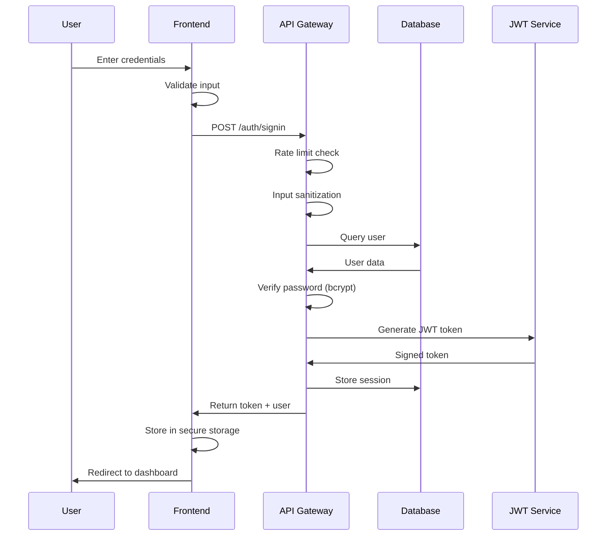
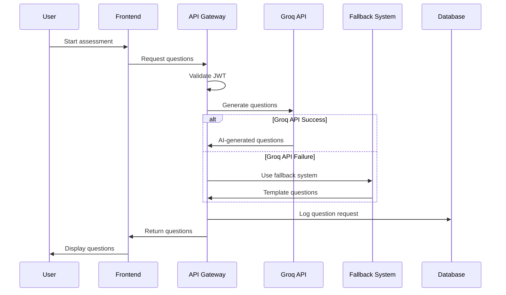
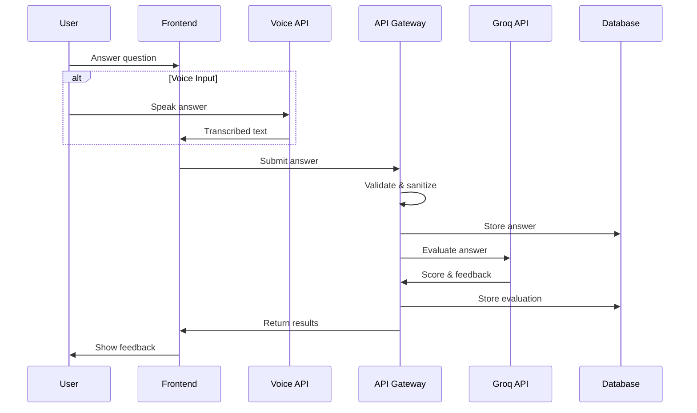
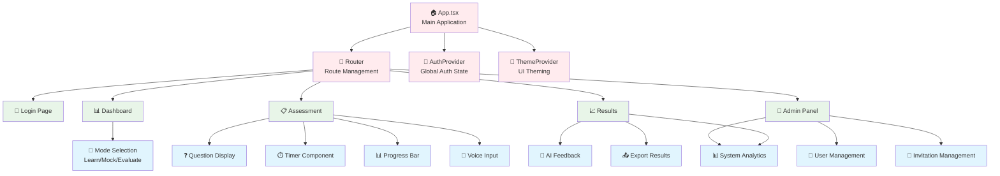
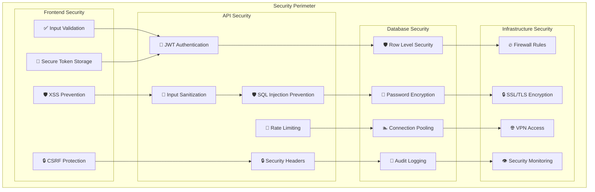
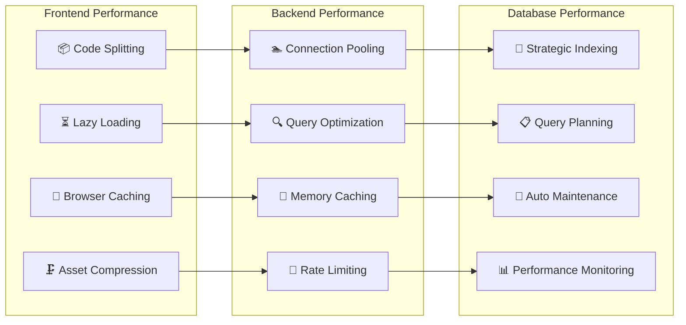

# HR Candidate Evaluation System - Visual Architecture

## 🎨 System Architecture Diagram

```mermaid
graph TB
    %% Client Layer
    subgraph "Client Layer"
        Desktop[🖥️ Desktop Browsers<br/>Chrome, Firefox, Edge]
        Mobile[📱 Mobile Browsers<br/>Safari, Chrome Mobile]
        Voice[🎤 Voice Input<br/>Web Speech API]
    end

    %% Frontend Layer
    subgraph "Frontend Layer (React + TypeScript)"
        subgraph "UI Components"
            Auth[🔐 AuthForm<br/>Login/Register]
            Config[⚙️ ConfigForm<br/>Assessment Setup]
            Question[❓ QuestionView<br/>Q&A Interface]
            Results[📊 Results<br/>Analytics]
            Invite[📧 InviteForm<br/>HR Tools]
        end
        
        subgraph "Custom Hooks"
            UseAuth[🔑 useAuth<br/>JWT Management]
            UseLLM[🤖 useLLM<br/>AI Integration]
            UseVoice[🎙️ useVoice<br/>Speech API]
        end
        
        subgraph "Build Tools"
            Vite[⚡ Vite<br/>Dev Server & Build]
            Tailwind[🎨 Tailwind CSS<br/>Styling]
            Motion[✨ Framer Motion<br/>Animations]
        end
    end

    %% API Gateway
    subgraph "API Gateway (Express.js)"
        subgraph "Middleware Stack"
            CORS[🌐 CORS<br/>Cross-Origin]
            RateLimit[🚦 Rate Limiting<br/>IP Protection]
            Helmet[🛡️ Helmet<br/>Security Headers]
            JWT[🎫 JWT Auth<br/>Token Validation]
            Validation[✅ Input Validation<br/>Sanitization]
        end
        
        subgraph "API Endpoints"
            AuthAPI[🔐 /auth<br/>signup, signin, signout]
            InviteAPI[📧 /invitations<br/>CRUD Operations]
            HealthAPI[❤️ /health<br/>System Status]
        end
    end

    %% Database Layer
    subgraph "Database Layer (PostgreSQL 18)"
        subgraph "DBO Schema"
            Users[👥 users<br/>Authentication]
            Profiles[👤 profiles<br/>User Info]
            Sessions[🎫 user_sessions<br/>JWT Tokens]
            Invitations[📧 invitations<br/>Assessments]
            Security[🔒 security_log<br/>Audit Trail]
        end
        
        subgraph "Database Features"
            Indexes[📇 Indexes<br/>B-tree, GIN, Partial]
            Triggers[⚡ Triggers<br/>Auto-updates]
            Functions[🔧 Functions<br/>Cleanup, Stats]
            RLS[🛡️ Row Level Security<br/>Access Control]
        end
    end

    %% External Services
    subgraph "External Services"
        GroqAPI[🤖 Groq AI API<br/>LLaMA-4 Scout<br/>Question Generation<br/>Answer Evaluation]
        Fallback[📚 Fallback System<br/>Local Question Banks<br/>Template Engine]
    end

    %% Infrastructure
    subgraph "Infrastructure & Deployment"
        Dev[🛠️ Development<br/>Vite HMR + Nodemon]
        Prod[🚀 Production<br/>PM2 + Nginx]
        Monitor[📊 Monitoring<br/>Health Checks<br/>Performance Metrics]
    end

    %% Connections
    Desktop --> Auth
    Mobile --> Auth
    Voice --> UseVoice
    
    Auth --> UseAuth
    Config --> UseLLM
    Question --> UseVoice
    Results --> UseLLM
    Invite --> UseAuth
    
    UseAuth --> AuthAPI
    UseLLM --> GroqAPI
    UseLLM --> Fallback
    
    AuthAPI --> Users
    AuthAPI --> Sessions
    InviteAPI --> Invitations
    HealthAPI --> Monitor
    
    Users --> Profiles
    Sessions --> Security
    
    JWT --> Sessions
    Validation --> Security
    
    GroqAPI -.-> Fallback
    
    Dev --> Vite
    Prod --> Monitor

    %% Styling
    classDef clientLayer fill:#e1f5fe
    classDef frontendLayer fill:#f3e5f5
    classDef apiLayer fill:#e8f5e8
    classDef dbLayer fill:#fff3e0
    classDef externalLayer fill:#fce4ec
    classDef infraLayer fill:#f1f8e9

    class Desktop,Mobile,Voice clientLayer
    class Auth,Config,Question,Results,Invite,UseAuth,UseLLM,UseVoice,Vite,Tailwind,Motion frontendLayer
    class CORS,RateLimit,Helmet,JWT,Validation,AuthAPI,InviteAPI,HealthAPI apiLayer
    class Users,Profiles,Sessions,Invitations,Security,Indexes,Triggers,Functions,RLS dbLayer
    class GroqAPI,Fallback externalLayer
    class Dev,Prod,Monitor infraLayer
```

## 🔄 Data Flow Diagrams

### Authentication Flow

### Question Generation Flow

### Assessment Evaluation Flow

## 🏗️ Component Architecture

### Frontend Component Hierarchy

## 🔐 Security Architecture

### Security Layers

## 📊 Performance Architecture

### Performance Optimization Strategy

This comprehensive architecture documentation provides a complete view of the HR Candidate Evaluation System's design, from high-level system architecture to detailed component interactions and security considerations.